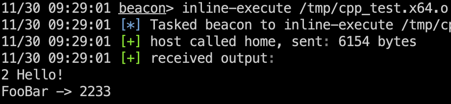

## 壹、使用方法

### 1. 工具链

默认使用msys2中的`mingw-w64-clang-x86_64-toolchain`，配置好msys2后，执行`pacman -S mingw-w64-clang-x86_64-toolchain`安装。  

### 2. Pass的参数

在编译时给clang命令行添加参数：`-mllvm -bxxx`来传递参数给Pass，现在支持的参数如下：
```
-bren 启用函数重命名，相当于全局开关
-bl   win32静态库的路径，msys2中一般是/clang64/lib或者c:/msys2/clang64/lib
-bverbose 打印详细日志，如果出现某个函数未能成功重命名，请开启这个选项查看日志
```

## 贰、原理：在新的LLVM Pass管理器中使用Pass编译BOF源码

### 1. LLVM Pass介绍

Pass在LLVM中是非常重要的一部分，字节码的生成与优化，以及机器码生成都是由各种Pass来完成的。通过Pass可以修改中间产物 IR 以及最终的目标机器码，以此完成一些自动化的修改工作，比如自动化混淆以及插桩。

自定义LLVM Pass的加载方式通常有两种，嵌入到LLVM编译器或者动态库接入，这里我们重点理解一下动态加载的方式，因为个人懒得去编LLVM，时间要节约下来卷死大家。

### 2. LLVM New Pass Manager

在LLVM中一直都有Pass存在，Pass的管理方式在新版做出了改进，然而现存的各种教程大部分还是介绍的传统Pass注册加载方式，让不少刚上手的人掉进了坑里。

在传统的Pass管理机制中，注册一个Pass需要创建一个全局的`llvm::RegisterPass`这个类的实例变量，我们都知道这个操作实在动态库初始化的过程中执行的，所以一旦动态库被LLVM加载那么Pass就注册进去了；而新版的Pass管理机制完全不同，它是通过导出函数的方式将注册主动权交到了编译器手中。

动态库通过导出函数实现Pass注册：

```c++
PassPluginLibraryInfo getPluginInfo() {
    return {
        LLVM_PLUGIN_API_VERSION, "cannopass", "0.0.1",
        [](PassBuilder &PB) {
            // 加到这个地方的话，这个callback一定会执行，opt里面就不用再传递-passes=xxx了，一些配置还是自己传参数更方便一些
            PB.registerVectorizerStartEPCallback(
                [](FunctionPassManager &FPM, OptimizationLevel level) {
                    FPM.addPass(HelloPass());
            });
        }
    };
}

// 直接从官方扣过来就行
extern "C" ::PassPluginLibraryInfo
LLVM_ATTRIBUTE_WEAK llvmGetPassPluginInfo() {
    return getPluginInfo();
}
```

在新的机制下，就算动态库被加载，Pass也不见得能注册到LLVM中去（必须手动获取导出函数并执行）。典型的情况就是传统方式在clang中加载Pass，clang添加参数`-Xclang -load -Xclang pass.so` 然后传递给cc1来加载Pass，这种情况在传统机制下没有问题，但在新机制中时完全没有作用的。（这是个坑）

### 3. 现有BOF编写的痛点

BOF，Beacon Object File，是Cobaltstrike中的一个非常实用的功能，可以快速开发一些小型的功能片段并加载到目标环境执行，是渗透活动更加灵活隐蔽。下面部分所指的BOF，皆为CS中可加载执行的BOF。

BOF是单个C文件编译后的单元，它的编写比较简单，只需要将外部函数定义为 library$function 的形式即可，在CS加载时，会先遍历BOF文件的符号表寻找所有以`__impl_`开头且以`library$function`命名的函数，将library与function保存下来，然后和BOF的各个字段一起发送给Beacon，Beacon通过library与function动态解析这些外部引用。整个过程不涉及链接操作，自然也就没有所谓的C运行时存在了，适合直接在本进程加载执行，副作用基本为零。

简单的BOF

```c
// 必须声明dllimport，这样编译成来的object文件里面的外部函数才会以__imp_开头
__declspec(dllimport) void __stdcall kernel32$ExitProcess(unsigned long);

void go(char* arg, int alen)
{
    kernel32$ExitProcess(0);
}
```

注意到了吗？我们调用`ExitProcess`这个win32函数的方式有点特殊，先是声明了一个`kernel32$`开头的函数，然后才调用他，这符合前面的描述。

在编写BOF时，经常出现的场景就是，要引用一个新的API就得先声明这个API，这为BOF开发增加了大量无意义的工作。作为新时代的卷王，我们怎么能忍受这种事情，让我们回到主题，通过LLVM Pass自动化修改函数名称。

### 4. LLVM Pass for BOF

背景介绍差不多了，现在开始我们的代码部分。

为了快速达到效果，先简单实现一个 FunctionPass 遍历C文件中函数中的每条指令，把call指令找出来，替换被调用的函数名称，下面是代码：

```c++
// 继承PassInfoMixin免去声明一些无关紧要的函数
class BofRenameFuncPass : public PassInfoMixin<BofRenameFuncPass>
{
public:
    static bool isRequired() { return true; }
    // 每个函数都会被传递到这里来执行一次
    PreservedAnalyses run(Function &F, FunctionAnalysisManager &AM)
    {
        // 遍历函数中的代码块
        for (auto& bb : F) {
            // 遍历代码块中的指令
            for (auto& i : bb) {
                // 如果是一条call的话，就尝试执行重命名操作
                if (i.getOpcode() == Instruction::Call) {
                    rename_function(cast<CallInst>(i));
                }
            }
        }
        // 必须，保留所有更改
        return PreservedAnalyses::all();
    }

    static void rename_function(CallInst& inst);
    static void set_called_function(CallInst& inst, std::string& name);
};

void BofRenameFuncPass::rename_function(CallInst& inst)
{
    auto CF = inst.getCalledFunction();
    if (!CF) {
        return;
    }
    std::string new_func_name;
    std::string cf_name(CF->getName());
    // 先简单写一下判断，快速看到效果
    if (cf_name == "ExitProcess") {
        new_func_name = "kernel32$ExitProcess";
    }
    set_called_function(inst, new_func_name);
}

void BofRenameFuncPass::set_called_function(CallInst& inst, std::string& name)
{
    auto CF = inst.getCalledFunction();
    // 在被修改的这个函数的命名空间（上下文）中插入新的函数名，也就是 library$function 这个格式
    auto func = inst.getFunction()
                ->getParent()
                ->getOrInsertFunction(name, CF->getFunctionType());
    // 将原来被调用的函数的一些重要属性转移过来，比如调用约定、dllimport属性
    auto* callee = func.getCallee();
    dyn_cast<Function>(callee)->setCallingConv(CF->getCallingConv());
    dyn_cast<GlobalValue>(callee)->setDLLStorageClass(GlobalValue::DLLStorageClassTypes::DLLImportStorageClass);
    // 替换被调用的函数
    inst.setCalledFunction(func);
}
```

这里只是简单的比较如果函数名称是`ExitProcess`就替换被调用函数，这肯定是不够用的，所以我想到是不是能从链接过程中得到启发，从静态库文件中寻找函数，并修补新的函数名称。

我们复习一下链接原理：将多个object文件的区段合并，从静态库中解析导入函数并链接到最终的文件中。在LLVM的lib目录中有windows相关的lib文件，所以现在问题转换成如何从静态库加载符号。

所幸LLVM中有一个叫做 `Archive` 的类，用于加载archive格式的文件，archive就是LLVM中的静态库文件格式。

编写一个类`Library`用于加载静态库，这里用到了MemoryBuffer，这是LLVM提供的类，可以方便的打开文件用于读取。

```c++
class Library
{
public:
    static std::unique_ptr<Library> load(std::string const& lib_name)
    {
        std::string path = clang64_root;
        path += "/lib";
        path += lib_name;
        path += ".a";

        auto errOrBuf = MemoryBuffer::getFile(path);
        if (!errOrBuf) {
            errs() << "failed to open " << path << ": " << errOrBuf.getError().message() << "\n";
            return nullptr;
        }

        auto err = Error::success();
        auto buf = std::move(errOrBuf.get());

        auto library = new Library(std::move(buf), err);
        if (err) {
            errs() << "failed to load " << path << ": " << err << "\n";
            return nullptr;
        }

        // errs() << "symbols loaded from " << path << "\n";
        return std::unique_ptr<Library>(library);
    }
};
```

定义一个全局的ArchiveLoader在pass初始化时加载默认的一些lib

```c++
class ArchiveLoader
{
public:
    ArchiveLoader()
    {
        archive_loader.load_archive("advapi32");
        archive_loader.load_archive("cabinet");
        archive_loader.load_archive("crypt32");
        archive_loader.load_archive("gdi32");
        // ...
     }
 };
 
 static ArchiveLoader archive_loader;
```

至此，这个基本的BOF Pass就完成了，在x64上测试能够完成基本的编译工作。

clang编译文件的时候运行Pass：

```shell
clang -fplugin=pass.dll -fpass-plugin=pass.dll -mllvm -bl=c:/msys64/clang64/lib -mllvm -bren -c
```

### 5. 参数传递

~~也是坑，以后再谈~~  
查看LLVM源码可知，NewPassManager加载PASS动态库的时机在参数解析之后，故此无法正常传入自定义的命令行参数。那么解决办法也很简单，让PASS动态库在PassManager初始化之前加载就行了。
这里我用Clang动态加载插件的功能来实现提前加载，怎么做呢，只需要在Clang命令行添加`-fplugin=pass.dll`，是不是很方便？  
其实我对LLVM Pass的了解仅限基本用法，不知道有没有比较“正经”的办法来实现参数传递，反正能用就成，实用为主！lol~

### 6. BUG与改进

上面的流程看似美好，实则暗藏杀机，经过多次踩坑，总结以下问题：

1. 编译32位时，stdcall的命名规范比较特殊，API以`_xxx@n`的规则生成，需要手动umangling；
2. IR经过优化会生成memcpy和memset函数，需要识别并修改为`msvcrt$`的形式。

```c++
if (cf_name.find("llvm.memcpy", 0, 11) == 0) {
    new_func_name = "msvcrt$memcpy";
}
else if (cf_name.find("llvm.memset", 0, 11) == 0) {
    new_func_name = "msvcrt$memset";
}
else {
    if (cf_name[0] == 0x01 && cf_name[1] == '_') {
        auto n = cf_name.find('@');
        if (n > 3) {
            cf_name = cf_name.substr(2, n - 2);
        }
    }
    auto libname = ArchiveLoader::get().find_library(cf_name);
    if (libname.empty()) {
        return;
    }
    new_func_name = formatv("{0}${1}", libname, cf_name);
}
```

3. 编译时添加-Ox优化后，会生成SSE相关指令，然而通常这些指令要求操作地址按照16字节对齐，CS的BOF加载逻辑应该是没有考虑到这一问题，data段没有对齐导致BOF执行时进程崩溃。
4. CS解析BOF的能力稍微差了点，没有实现对多个代码段、数据段的合并（只能加载.text .data .rdata，然而C++生成的obj文件通常包含多个区段），也没有对C++符号的解析能力。  
只能写C语言的BOF还是让人有那么一点不爽，所以我修改了一下BOF加载逻辑，允许在CS对BOF预加载时合并区段并解析C++符号，再写一个BOF基类用于实现一些常用的功能，简化BOF开发。  
这样，新的BOF模板如下：
```c++
#include <beacon.h>

// Macro for void go(...) defination.
go(TestBof)

class TestBof : public bof
{
public:
    void execute() override
    {
        int len = 0;
        const auto pid = get_integer<DWORD>();
        const auto payload = get_cstring(len);
        f (len == 0) {
            println("error: wrong parameter");
             return;
        }

        const auto process = OpenProcess(PROCESS_ALL_ACCESS, false, pid);
        // Inject payload into the target process......
        CloseHandle(process);
    }
};

```
如果有时间再更新一点新的BOF加载的实现思路。

5. 对STL容器的支持  
最近想把某个项目转换成BOF来用，但是代码中用到了STL类型，改起来比较麻烦。考虑到STL的容器一般不会用到libc++之类的外部函数（可以被重载的new和delete不算），所以在BOF中使用STL也不是不行滴。  
经过测试发现`std::string`的代码会生成对`memmove`函数的调用，故将其解析到`msvcrt$memmove`即可。  
测试代码和结果：
```c++
class my_bof : public bof
{
public:
    void execute() override
    {
        std::vector<std::string> test;
        test.push_back("Hello!");
        test.push_back("FooBar");
        println("%zu %s", test.size(), test.front().c_str());
        std::map<std::string, int> map;
        map.emplace(test.back(), 2233);
        for (auto& t : map) {
            println("%s -> %d", t.first.c_str(), t.second);
        }
    }
};
```



### 7. 参考链接

- https://llvm.org/docs/LangRef.html
- https://llvm.org/doxygen/classllvm_1_1Function.html
- https://llvm.org/docs/WritingAnLLVMNewPMPass.html
- https://llvm.org/docs/NewPassManager.html
- https://bbs.kanxue.com/thread-272801.htm
